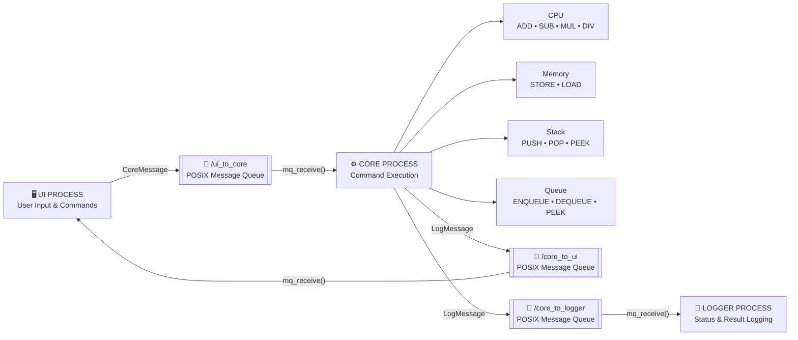

# IPC TECHNIQUES

## 1. POSIX MESSAGE QUEUES

The Multi-Process Simulator uses **POSIX Message Queues** as the primary Inter-Process Communication (IPC) technique.

POSIX Message Queues allow the independent **UI, Core, and Logger processes** to exchange structured messages through operating-system-managed queues.

### Message Queues Used

| Message Queue | Communication | Purpose |
|---|---|---|
| `/ui_to_core` | UI → Core | Sends user commands and input values |
| `/core_to_ui` | Core → UI | Sends operation results and status information back to the UI |
| `/core_to_logger` | Core → Logger | Sends operation results and status information to the Logger |

### Message Structures

The UI sends a `CoreMessage` to the Core process.

```c
typedef struct
{
    int command;
    int value1;
    int value2;
    char instruction[MAX_MESSAGE];
} CoreMessage;
```

The Core sends a `LogMessage` to the UI and Logger processes.

```c
typedef struct
{
    int status;
    int result;
    char message[MAX_MESSAGE];
} LogMessage;
```

### POSIX MESSAGE QUEUE FUNCTIONS USED

| Function | Purpose |
|---|---|
| `mq_open()` | Creates or opens a POSIX message queue |
| `mq_send()` | Sends a message through the queue |
| `mq_receive()` | Receives a message from the queue |
| `mq_close()` | Closes the message queue |
| `mq_unlink()` | Removes the message queue |

---

# 2. IPC COMMUNICATION FLOW

The simulator uses three message queues for communication between the three processes.

### UI → CORE

The **UI Process** accepts the user's command and input values and sends them to the **Core Process** through `/ui_to_core` using `CoreMessage`.

### CORE → UI

After executing the requested operation, the **Core Process** sends the result and status information back to the **UI Process** through `/core_to_ui` using `LogMessage`.

### CORE → LOGGER

The **Core Process** also sends the operation result and status information to the **Logger Process** through `/core_to_logger` using `LogMessage`.

---

# 3. ARCHITECTURE DIAGRAM



---

# 4. ARCHITECTURE EXPLANATION

The simulator is divided into **three independent processes: UI, Core, and Logger**. Each process performs a specific responsibility and communicates with the other processes using POSIX Message Queues.

### 1. UI PROCESS

- Accepts commands and input values from the user.
- Creates a `CoreMessage`.
- Sends the message to the Core Process through `/ui_to_core`.
- Receives the operation result from the Core Process through `/core_to_ui`.
- Displays the result and status to the user.

### 2. CORE PROCESS

- Acts as the main processing unit of the simulator.
- Receives commands from the UI Process.
- Executes CPU operations such as:
  - ADD
  - SUB
  - MUL
  - DIV
- Handles Memory operations:
  - STORE
  - LOAD
- Handles Stack operations:
  - PUSH
  - POP
  - PEEK
- Handles Queue operations:
  - ENQUEUE
  - DEQUEUE
  - QUEUE PEEK
- Creates a `LogMessage` containing the operation status and result.
- Sends the result to the UI Process through `/core_to_ui`.
- Sends the same result to the Logger Process through `/core_to_logger`.

### 3. LOGGER PROCESS

- Receives `LogMessage` from the Core Process.
- Displays the operation status and result.
- Records the activity of the simulator.
- Does not directly communicate with the UI Process.

### 4. IPC CONNECTION

The three processes communicate through separate POSIX Message Queues:

- `/ui_to_core` → UI sends commands to Core.
- `/core_to_ui` → Core sends results back to UI.
- `/core_to_logger` → Core sends results to Logger.

The **CPU, Memory, Stack, and Queue are internal components of the Core Process** and are not separate processes.
