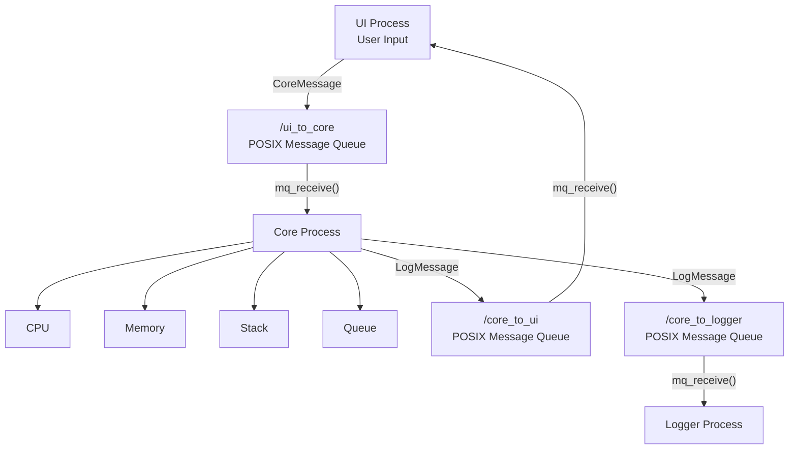

# IPC Techniques

## 1. POSIX Message Queues

The Multi-Process Simulator uses **POSIX Message Queues** as the main Inter-Process Communication (IPC) technique.

POSIX Message Queues allow the UI, Core and Logger processes to exchange messages through operating-system-managed queues.

### Message Queues Used

| Message Queue | Communication | Purpose |
|---|---|---|
| `/ui_to_core` | UI → Core | Sends commands and input values |
| `/core_to_ui` | Core → UI | Sends results and status back to UI |
| `/core_to_logger` | Core → Logger | Sends results and status to Logger |

### Message Structures

The UI sends a `CoreMessage` to the Core process.

```c
typedef struct
{
    int command;
    int value1;
    int value2;
    char instruction[MAX_MESSAGE];
} CoreMessage;
```

The Core sends a `LogMessage` to the UI and Logger.

```c
typedef struct
{
    int status;
    int result;
    char message[MAX_MESSAGE];
} LogMessage;
```

### POSIX IPC Functions Used

| Function | Purpose |
|---|---|
| `mq_open()` | Creates or opens a message queue |
| `mq_send()` | Sends a message through the queue |
| `mq_receive()` | Receives a message from the queue |
| `mq_close()` | Closes the message queue |
| `mq_unlink()` | Removes the message queue |

---

## 2. IPC Communication Flow

### UI to Core

The UI accepts the user's command and input values and sends them to the Core using `/ui_to_core`.

```text
UI Process
     |
     | CoreMessage
     ↓
/ui_to_core
     |
     | mq_receive()
     ↓
Core Process
```

### Core to UI

After processing the command, the Core sends the result and status back to the UI using `/core_to_ui`.

```text
Core Process
     |
     | LogMessage
     ↓
/core_to_ui
     |
     | mq_receive()
     ↓
UI Process
```

### Core to Logger

The Core also sends the operation result to the Logger using `/core_to_logger`.

```text
Core Process
     |
     | LogMessage
     ↓
/core_to_logger
     |
     | mq_receive()
     ↓
Logger Process
```

---

# Architecture Diagram

The overall architecture of the Multi-Process Simulator is shown below.



---

## 3. Architecture Explanation

The system consists of three independent processes:

1. **UI Process**
   - Accepts commands and input from the user.
   - Sends commands to the Core process.

2. **Core Process**
   - Receives commands from the UI.
   - Performs CPU operations such as ADD, SUBTRACT, MULTIPLY and DIVIDE.
   - Handles Memory operations such as STORE and LOAD.
   - Handles Stack operations such as PUSH, POP and PEEK.
   - Handles Queue operations such as ENQUEUE, DEQUEUE and QUEUE PEEK.
   - Sends results to the UI and Logger.

3. **Logger Process**
   - Receives results from the Core.
   - Displays/logs the operation status and result.

### Overall Communication

```text
User
 ↓
UI Process
 ↓
/ui_to_core
 ↓
Core Process
 ↓
CPU / Memory / Stack / Queue
 ↓
 ┌───────────────────────┐
 ↓                       ↓
/core_to_ui       /core_to_logger
 ↓                       ↓
UI Process          Logger Process
```

**IPC Technique Used:** POSIX Message Queues  
**Processes:** UI, Core and Logger  
**Communication:** UI ↔ Core and Core → Logger
